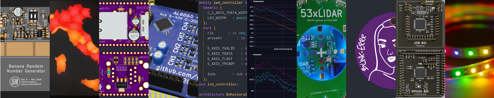

***VALERIO\NEW** IS PROVIDED "AS IS", WITHOUT WARRANTY OF ANY KIND, EXPRESS OR IMPLIED, INCLUDING BUT NOT LIMITED TO THE WARRANTIES OF MERCHANTABILITY, FITNESS FOR A PARTICULAR PURPOSE AND NONINFRINGEMENT. IN NO EVENT SHALL THE AUTHORS OR COPYRIGHT HOLDERS BE LIABLE FOR ANY CLAIM, DAMAGES OR OTHER LIABILITY, WHETHER IN AN ACTION OF CONTRACT, TORT OR OTHERWISE, ARISING FROM, OUT OF OR IN CONNECTION WITH **VALERIO\NEW** OR THE USE OR OTHER DEALINGS IN **VALERIO\NEW**.*

### 🚧 My repos:

#### 🛠 Hardware:
- [WS2812-driver](https://github.com/valerionew/WS2812-driver): A multi-thread oriented multi-platform library for driving WS2812 LEDs on microcontrollers, targeting mainly STM32. 
- [fablab-bergamo/OrtoSmart](https://github.com/fablab-bergamo/OrtoSmart): An educational environmental monitoring project with Fablab Bergamo and the Youth Office of the Bergamo municipality, Italy.
- [Colors of Italy](https://github.com/valerionew/colors-of-italy/): A lamp that helps keep track of the COVID restrictions enforced in the italian regions
- [Basil365](https://github.com/valerionew/basil365): *On hold*. I want fresh basil all year round, but outdoors here it doesn't grow. Let's fix this, and make it IoT
- [Banana Random Number Generator](https://github.com/valerionew/Banana-Random-Number-Generator): What if we could use bananas as a source of cryptographical grade entropy?
- [Blink-errr](https://github.com/valerionew/blink-errr): A blinking led that will go on blinking for as long as 10 years on a CR2032 cell
- [53xLIDAR](https://github.com/valerionew/53xLIDAR): A solid state, 16-points, LIDAR based on STMicro's VL53L1x time-of-flight IR sensors
- [Very good uC doggos](https://github.com/valerionew/very-good-uc-doggos): A small graduation present for a friend, featuring a selection of microcontrollers and dog memes
- [Omega dock new](https://github.com/valerionew/omega-dock-new): Dock with ethernet and usb host for the Onion Omega 2
- [ADC-DAC-16bit](https://github.com/valerionew/ADC-DAC-16bit): *Archived*. An attempt at having a 16 bit ADC + DAC on a single 20x20mm module

#### 💻 Software:
- [Wordle solver](https://github.com/valerionew/wordle-solver): My attempt at writing a [Wordle](https://www.nytimes.com/games/wordle/index.html) solver that exploits bayesian tracking.
- [ITA keyboard enhanced](https://github.com/valerionew/ITA-keyboard-enhanced): An italian keyboard for windows, featuring ÀCCÈNTÉD VÒWÈLS ÌN CÀPS
- [Computational madness](https://github.com/valerionew/computational-madness): How fast can you get to an estimate of Pi with one of the most inefficient methods?

#### 📖 Documentation:
- [Unisolder notes](https://github.com/valerionew/unisolder-notes): (Almost) everything you'll need to build your unit of the open source universal soldering iron controller
- [ATTiny10 notes](https://github.com/valerionew/attiny10-notes): Notes on the tinyest ATTiny - 4 GPIOs can be enough sometimes

#### 📚 Libraries:
- [HT1621 7-seg](https://github.com/valerionew/ht1621-7-seg): A library for driving a 7 segment LCD based on a HT1621 controller with arduino

#### 🎓 University projects: (Politecnico di Milano, bachelor and master in EE)
- [triennale-elettronica-polimi](https://github.com/valerionew/triennale-elettronica-polimi): A [website](https://valerionew.github.io/triennale-elettronica-polimi/) containing a collection of notes, code and more from my degree. With time, many students contributed with their own notes, and the website now hosts almost one hundred resources contributed from many of students.
- [Sensor systems course](https://github.com/valerionew/sensor-systems-course): Repository with STM32 HAL embedded code from the Sensor Systems course
- [DESD fpga code](https://github.com/valerionew/desd-labs): VHDL repository for the digital electronic systems design course, targeting a Xilinx Artix-7 board (Basys 3)
- [Calcolo Numerico](https://github.com/valerionew/calcolo_numerico): MATLAB code for the numerical analisys course
- [Microcontrollori](https://github.com/valerionew/microcontrollori-polimi): Repository for the microcontrollers course, register level programming targeting 8 bit PICs 
- [Elettronica digitale](https://github.com/valerionew/elettronica-digitale-notes): VHDL repository for the digital electronics course, focused on behavioral VHDL basics and simulation

#### 🔁 Happily contributed to:
- [Microsoft Stream URL extractor](https://github.com/MicrosoftStreamURLExtractor/MicrosoftStreamURLExtractor.github.io): A tool to help PoliMi students download the video lessons of their courses
- [KiCAD Symbol Library](https://github.com/KiCad/kicad-symbols): The compoents library of KiCAD
- [KiCAD Footprint Library](https://github.com/KiCad/kicad-footprints): The footprint libray of KiCAD
- [PIC Notes](https://github.com/Squareroot7/pic-notes): Course note on PIC microcontrollers (in italian)
- [ADB-3020-CDV](https://github.com/Testato/ADB-3020-CDV): Fork of a 30V 20A adjustable bench switching power supply..

### 🌐 External
- [My Thingiverse profile](https://www.thingiverse.com/valerio_new)
- [My hackaday.io profile](https://hackaday.io/valerionew)
- [Fablab Bergamo](fablabbergamo.it) - [Also on Github!](https://github.com/fablab-bergamo)

